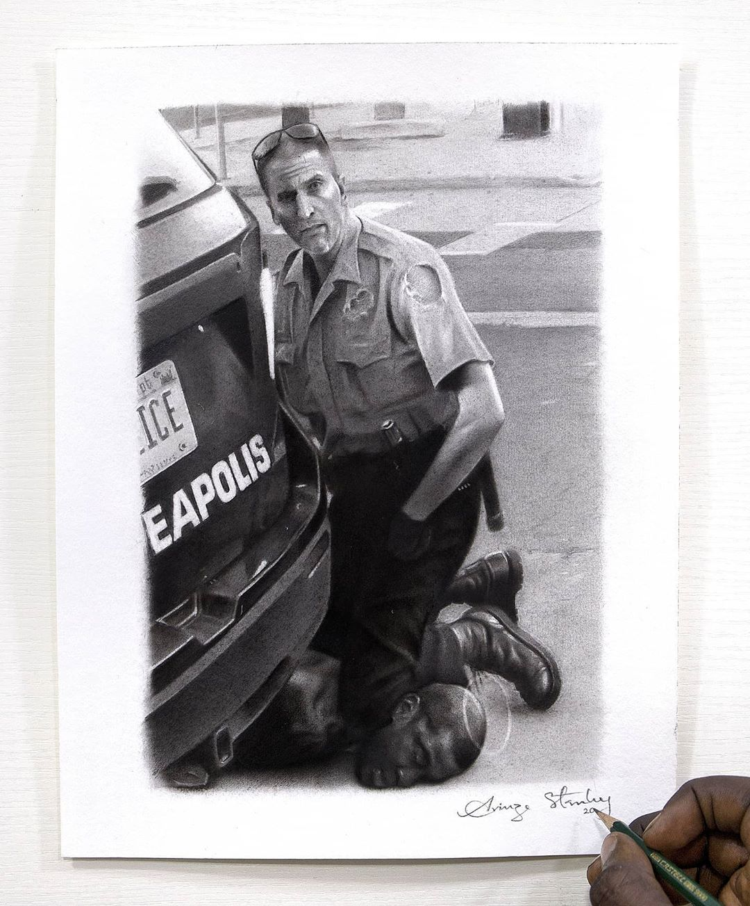

Black lives matter, but Derek Chauvin has said no to that important pharse. A phrase that says more than just three words. 

The killing and unjust treatment of blacks by white police officers is no new thing to be heard of. Sick people exists everywhere. The dickheads never died, they are back and now hating more on pigment.

Derek Chauvin a **former** Minneapolis police officer (has been sacked) has been charged with a third degree murder and a second degree manslaughter in the United States following the death of an unharmed black man in custody. He was seen kneeling on Mr. Floyd's neck. Where George Floyd last words were "I can't breathe". Such wickedness. 

https://www.youtube.com/watch?v=Ve8S0rGd9-c

Those words "I can't breathe", being not only the last words of George Floyd, but also of Eric Garner a similar case that occured in New York, 2014.

## Here goes another dickhead

Here goes [Richard Spencer](https://en.wikipedia.org/wiki/Richard_B._Spencer), another dickhead, in the interview below, one I caught on Twitter. Really, his own stupidity is on a whole new level. Didn't believe these people existed, but now that shit is getting real, I'm not just starting to believe their existence, I believe already. Watch the video and listen to him rant bullshit.

https://twitter.com/Iamkeezus/status/1265697229303660544?s=20

This world is going to shit on jet speed, and there's nothing anyone can do about that. You open your eyes here and there and eveything gone to shit in just a split second. Isn't that terrible?

Richard Spencer said that nonesense after the incident of George Floyd. See how naive and ignorant even the so called white men can get. Yet he says and I quote "Yeah white privilege is wonderful, I wanna expand and deepen white privilege". 

https://twitter.com/ParissAthena/status/1266543615691628544?s=20

"The fact that this man left that room alive...🤦" Matter of fact: He shouldn't have! 

## Supports for George Floyd

George Floyd has received a lot of support as protest took place in front of the White House, US. A protest that placed the White House on lockdown from Friday night till Saturday morning.

Customized T-shirts also being sold on Amazon, called "I can't breathe T-shirts".

Community support for George Floyd didn't just end in the US and on T-Shirts customizations only. On here are also some artworks created by some Nigerian artists based on the incident and in memory of George Floyd.

### Arinze's artwork on the incident

From a famous artist, Arinze Stanley:

### Sherif's artwork on the incident

Also, a quick sketch from Sherif right here:

Feyisitan Sherif is an artist. Do you need a work of art. He's got a message for you:

> Hello, I'm Sheriff...I'm a ballpoint pen artist, I also create wearable art...you might be needing my services sometime
> And I also love to make new friends, let's talk
> [join me on WhatsApp](https://wa.me/2348131567421)

Racism never ended, but one thing to note is; Not all white men are racist.  
Joyner needs to release _Devil's Work 2_ #BringBackGeorgeFloyd #TakeRichardSpencer #TakeDerekChauvin.
