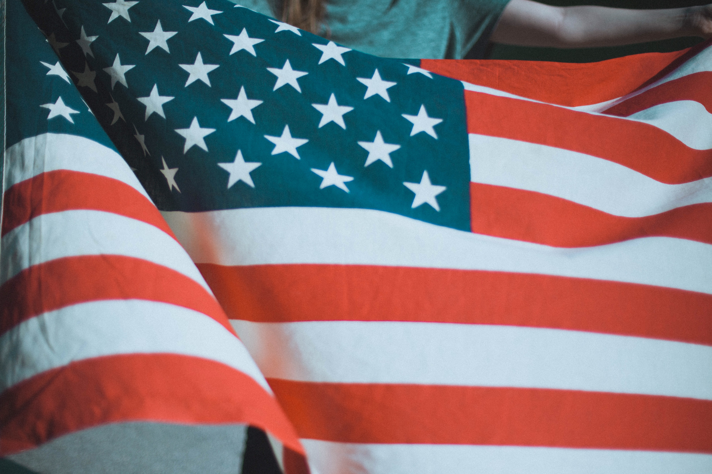

Sparks in the air like the first of July or sparks in the air like the fourth of July; it's a new month and even Chris Brown knows that, but not "Only" he knows that, we all do. **Happy New Month!**

Yeah, happy new month fam. How was the last? Wait don't say, 🖐, like it has always been? Sitting your boring ass at home? Whoops! Sorry mate, I wish it could be better and I hope it will be better this month, not promising, though. Who am I to promise you that. Just positive vibes. 

But come to think of it with some few students and pupils resuming this month, if the FG don't take back their word, it should be better. Oh, wait! Would it? What if you are an adult or a student, yet not part of the resuming students and pupils? I know how interesting and troublesome a full house could be, I just hope the month won't be a nasty one without everyone in the house doing a fulltime. One way to find out: Living through the month hail and hearty. So once again, I wish you a happy new month in good health. Not a cor*na (I don't want to mention it this month, God help me) or whatever-sickeness troubled health, all those bad energies stay far away.

## It's America's month!

Really, really, really! It's America's month so I can't agree with Chris Brown more, right now. Sparks in the air like the fourth of July!

Whoops! Will the Americans celebrate in thier houses and the White house also celebrate in-house while Trump does his fireworks in the Oval Office as he reads his speech on National TV to all Americans, ending it with "God Bless America"? Let's wait to see. Oh if you lame and you know it, be quiet.

## Hey, it's July!

Hey, it's not just July. The year is almost done. We are past half. Don't ask me how it went so I don't ask you too. Thank you.

Anyway, it went quite as in the above picture. At least I achieved something, guess what, no not that. "I stayed safe 😃". I hope to stay that way.

It's July and I'm happy my country is making progress with the issue at hand. By "progress", I mean asking students in classes that write external and entrance exams to resume. It's really a step forward and a brave one by the FG. Still people are furious, parents especially, throwing their wards into the wild frightens them. Don't worry the federal government is just doing some minor chemistry test. It's just 10 marks. I think the test starts 6th July or has started this week. In a week or so, observation and inference would be recorded and we can see if the test passes or fails.  

Anyway, anyhow, thanks for staying glued. Hapy new month!

