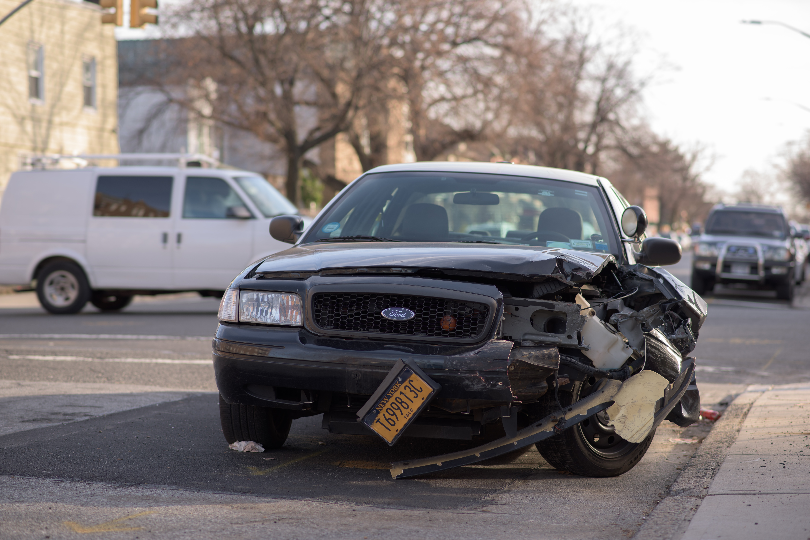

<!-- Writer and Graphics Designer of some sort.
You can contact me through the following means:
IG; aniediii
Whatsapp; 0903880724 -->

In the olden days, curses were often attributed to witches who were believed often used it as a way to punish persons, generations or settlements. There were plagues, crises, outbreak of great epidemics that claimed lots of lives(like ours) and so because of lack of science, sheer common sense and sense of hygiene, they decided to believe that great evil was mostly instigated by something or someone.

I would define a curse in this case I'm about to discuss, as a repetitive phenomenon that happens to everyone. No distinctions, no exceptions, nothing. So far, the situation has a person in it, the wheel will turn steadily.

We've all been in a car, right? Well if you haven't, it's a four wheel cart often crammed up with sweaty individuals wishing to cover great distances. Some are more comfortable than others, with the air conditioning and all. Well I'm not going to talk about a car, oh no! This is about the man in control of its gears.

On one, especially sweaty, Tuesday, John was awfully late for work. He got a shaky cab to take him to work. Everything went on steadily...did you get that? So far so good, he was closing the distance between himself and his angry boss, and boy, his boss did have a temper.

Suddenly, the driver who had been trying to send a text message to someone swerved to avoid something that wasn't there to hit something that actually was(a waxed sleek emerald BMW). Okay, stop. Ever heard of this sentence, everyone else is insane except the one at the wheel? That is exactly what's about to happen. Let's continue. The cabbie almost shot out of his window forgetting to open the door which gave the passengers, including John, some level of comic relief. Yeah, they needed it for what was to come.

The cabbie was a thin scrawny looking man, whose face was ridden with wrinkles mostly gotten from exhaustion and vexation. He smelt of old smoke and cheap perfume. When he came free, it almost looked like he jumped out the door, with his battered shoe in his hand ready to be hurled at his "assailant".

The BMW'S door came open and out came the most elegant lady John had ever seen. She wore a green shirt gown that stopped at her knees. She looked at least 6.2 feet tall. Let's just say John was in Fantasy Land.

Bam! The cabbie slammed his shoe on the car's hood again and again. Saying again and again that she had hit him. She looked at him in a demeaning way as he struck her hood repeatedly. She turned to her door with a grin on her face, opened it and get this, brought out a maple wood, hard, base ball bat, took a swing like a pro, shattered the cabbie's windscreen then pointed the bat's head at him daring him to touch her car's hood again.

Smitten with fear and held fast by glue proudly produced by the love for his life, he stood very still, amazed.

The lady got in and drove away obviously to a car wash. So I just want to say that when at the wheel, try, yes, try not to get too dramatic because in the heat of the moment lives can get their first class tickets to jail. You might not have realized the reason why you are allowed to drive but it is because the government trusts and believes that whoever has gotten the license has got sense!

Also try to focus on the road before you because when you don't, you could turn up injured or worse. You surely won't reach that destination your were hurriedly trying to get to.

Speaking of hurry, dear John had forgotten all about getting to work in a rush and was now staring at the BMW as it zoomed into the horizon, like Zorro taking to the wind.
