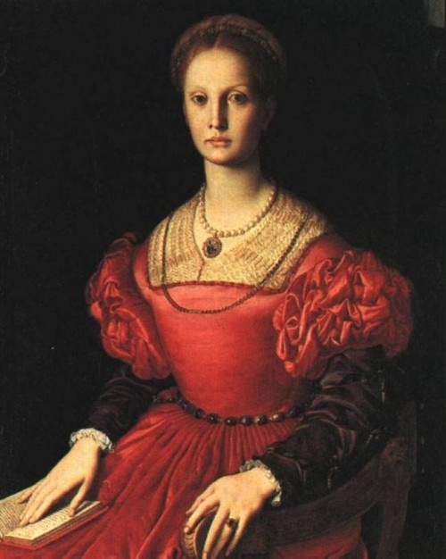
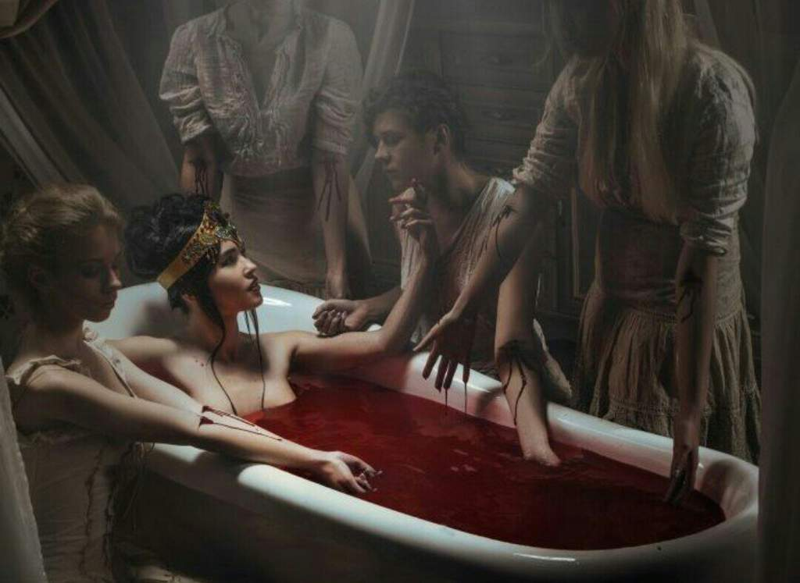

Meet Elizabeth Bathory the most evil prolific serial killer
The most prolific female serial killer Elizabeth Báthory (western name) and goes by Ecsedi Bathory Erzsébet (Native form) was an Hungarian noblewoman born to the noble family of Bathory who owned land in the kingdom of Hungary which is now known as Hungary Slovakia and Romania. She was born 7 August 1560 and died 21 August 1614 which means she was aged 54 at the time of her death, she had a spouse by the name Ferenc II Nádasy and children: Paul, Anna, Ursula, Katherine, Ferenc died on 4 January 1604.

She was recorded as the most prolific serial killer by The Guiness World Record she was estimated to have killed over 600 people mostly young girls between 1590-1610 (20 years). claimed that by bathing in the blood of virgins she would retain her youth. Bathory as a child suffered multiple seizures that may have been caused by epilepsy, possibly genetically from her parents and at the time symptoms relating to epilepsy were diagnosed as falling sickness and believed treatments were running blood of a non epileptic on the lips of am epileptic or giving the epileptic a mix of a non epileptic's blood and piece of skull as their seizures ended. This led to assumptions that her killings during her later life were as a result of her efforts to cure the illness she had been suffering from since childhood. There were also rumours that she was trained to be cruel and taught with satanism and witchcraft by her family members. Witnesses testified that her victims were mostly the lesser Gentry that she lures them to come walk for her in the castle promising to pay them well.

Bathory's forms of killing include tortures aided by her collaborates identified to be her servants. Her ways of torturing as testified by many witnesses were: severe beatings; burning or mutilation of hands; biting the flesh off the faces; freezing off the arms and other body parts or starvation till death. The collaborators also mentioned the use of needles in the court, according to other witnesses the victims were also burned in hot thongs and then placed in freezing cold water, they were also covered in honey and live ants, she was also suspected of cannibalism. Others reported to have seen traces of torture on dead bodies some of which were buried in graveyards. Two court officials named Benedek Deseo and Jakah Szilvassy claimed to have personally witnessed Bathory torture and kill young servant girls though their statements cakes months after her arrest so it's possible they were afraid of torture if they didn't give the desired answers.

Bathory was later charged with murder but due to her noble family's influence she escaped the death penalty and was condemned to confinement till death, locked in a brick room where she was able to move freely and unhindered in the castle, the bondage could be called house arrest today. She died on 20 August 1614 and was buried on 25 November 1614 where she was buried at the cemetery of the church of Csejte but due to the villager's protest her body was later moved to her home town at Ecsed. She was often compared to Vlad the Impaler of Wallachia and was popularly known as The Blood Countess. A movie was made based on her story in 2009 written and directed by Julie Delpy titled The Countess.

So, what's your personal thought on this, to me these forms of torture are traumatic pains I would never wish for my enemy and the fact that she escaped the death penalty just further shows how unbalanced life is. Well she had her good deeds like when she intervened on behalf of destitute women and a woman whose daughter was raped and impregnated.
