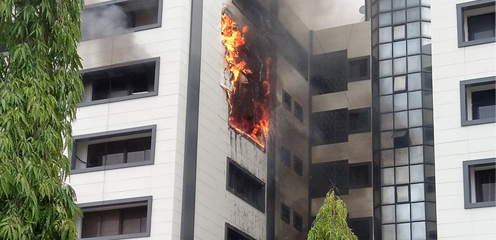

<>
</>

It is interesting how this year started with high hopes from everyone except, probably, some fortune tellers and prophets. Some say: "This year is just so hyped". The hype started with Bella Shmurda, the _Vision 2020_ artiste. To be honest, he wasn't the only one that pushed for the #Vision20 hashtag; many others went down that road, too. Anyway, it shouldn't be surprising; before every breakthrough there certainly must be something to break. Let's just hope we have something to break before the year '20 runs out, if not, #Vision21 all the way!

If you still didn't get what it is I am saying: It's that; the year is running out as fast as the pandemic spreads, and the "chinese virus" has infested almost half of the year and put studies, businesses, almost totally everything, on hold.

Along the way, some have been laid off their job since firms and companies can't afford to continue catering for employees who are just sitting at home&mdash;thanks to the outbreak. The worst of it all, the reality we can't hide from, is the realization that; lives have been lost to this cause. When everything ends (hopefully), things can no longer go back to the way they used to be, at least not for some people who have lost something or someone so dear. I am pretty sure we have all lost something dear: to some of us time as it may seem, some loved ones, some job. Through it all, one thing we should never lose is **focus**.

Talk about not losing focus...

## What have you been doing?

Seriously though, how you holding up?  
We've been talking about things being put on hold or to call it as it is&mdash;lockdown. Let's hope your goals are not in a state that left the streets all around the world to be trodden by animals only. Even footballers are netting goals from home, training with their kids and having fun (family goals). As much as I hate to be on the judgemental side, I'll pass on this. If you put your goals on hold and tell yourself; "it's not my fault, it's the 'chinese virus'", then I guess the only virus that can ever take a toll on you is **laziness**. This is no time to laze around, irrespective of the circumstance at hand. It might surprise you, when this all wraps up, to not meet some folks where you expect them, 'cause they made themselves a jetpack in a time like this and have flown farther than you can imagine.

That well said; please tell me I didn't sound like a motivational speaker 🙄

## We don't know what to expect anymore

Are we left in the terrible hands of fate or are we right to raise our hands to pray and have faith that everything will be back to normal soon? With the way statistical numbers are spiking, we wake up every day to shock. We hope it doesn't get to the point where even "shock" wakes up every day to us, beacuse we ain't shocked anymore and even "shock" is shocked to meet us in a new day knowing full well we pulled through the previous day. At that point, every day would not be a day to live, but a day to strife to filter out life from the virus-infested air we have managed to breathe in. Then the world would be looking like one of those Netflix movies.

Are we just going to resume our normal lives and leave those who will survive for fate to decide? No, it can't be! Our decision to live is something we make for ourselves backed by the Almighty. Not something we put in the hands of "the law of surprise".

Whoa whoa whoa! Now that's some intense shit 😩

## We don't know what to believe anymore

What should we believe in times of distress like this? Rumor has it that the number of reported cases are overstated, some other story lays claim that there is no such thing as corona virus in Nigeria. The latter sounds unresonable and illogical, but trust me this is Nigeria. Believe it and don't believe it. Confused, right? Don't take it out on me. Go take it out on those in control of the malformed system we are both caught in. A country as crazy as this needs some badass crazy citizens too, and yes there are oodles of them. Citizens that would hear the system give some reason why what is theirs is now something to be shared within the compromised system and would just laugh at it and make some troll and skit on twitter about it, aren't we crazy too?

We can't tell what is true anymore. Conspiracy theories is what follows every catastrophe when we are not well informed and are left in the dark by the system. People think a million times about an issue and can give a thousand million theories about what caused the issue, and of all theories, you want to believe one is true. Then your brain is consumed estimating what might be true and what might be false.

## 2020 is almost done

When is everthing going back to normal, when will studies resume and we can finally feel safe walking amongst creatures of the same kind? When will we be distant enough from "social distancing" and can give our friends and loved ones a hug without fear, but with absolute gladness? Is it anytime soon? These are questions no one can answer. 

Let there be a vaccine or cure for COVID-19 just this moment, we are still talking about months if not years to produce enough of it and ensure proper administration to everyone who should have it. Let me tell you this, buddy: "Have a nice time and enjoy the long vacation!". COVID-19 on this one.
