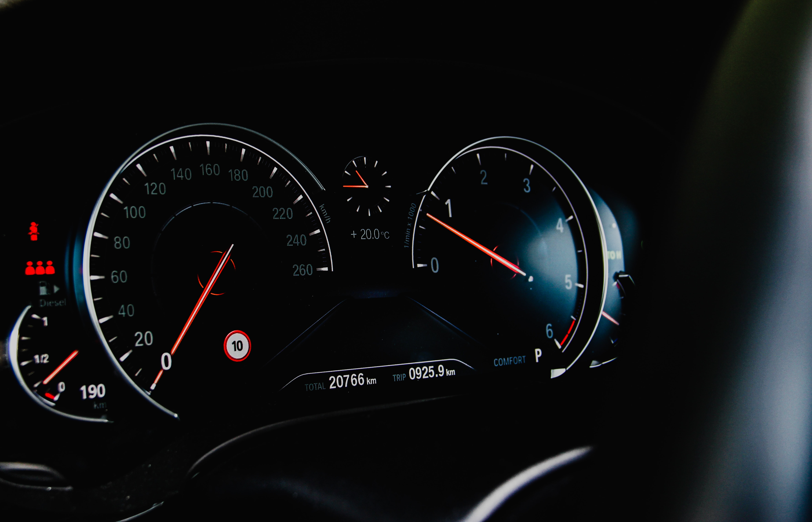
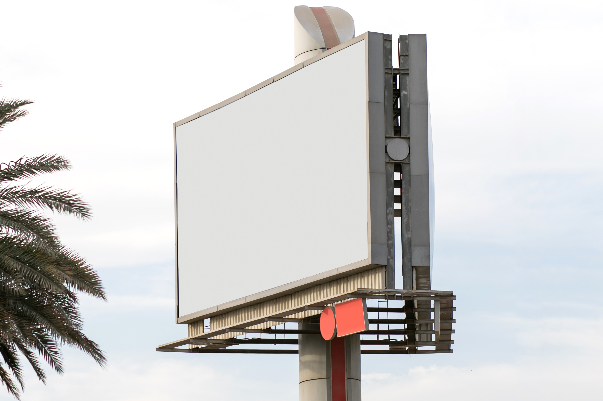

import { LinkButton } from "../components/button"

<>
</>

Hello to everyone out there, this is Eaveswall! We welcome you to the launch of this blog site, thanks for reaching out. We hope you keep coming to read our intriguing contents, gists, updates and as we usually say: "The eaves that drop; the wall that falls". Don't just let the eaves drop we'll pick it before it even lands, and don't let the wall fall, we'll peek in before it rises.

We do nothing here, but sit and watch eaves drop and walls fall, and tailor you with the best content, vibes, gist, discussions on all conceiveable topics&mdash;being crucial, the fun too. As creepy as that sounds, we don't eavesdrop and we don't gossip.

Our media is not only limited to this blog site (isn't it obvious already?, since "media" is plural), we have a [Twitter handle (@eaveswall)](https://twitter.com/eaveswall) too. You should follow us: as most of the interactions take place there. Amongst which is our [Instagram (@eaveswall_)](https://instagram.com/eaveswall). You see, we mean business and we got you all covered.

<!--  -->

Although we sit in Ibadan, Nigeria, we are not limited or loaclized to a specific location, we provide general discussions you can engage in, as long as it makes your day, we'll make your days. Eaveswall is the right media for you, look no further! Don't fret _mafo_.

## You've just got to engage

<!--  -->

Engage with all eaves from here that interests you. Why turn a blind eye when you can keep staring and say "holla". We need your engagements and interactions to make Eaveswall an interesting media platform for us all. So this whole thing is incomplete without you&mdash;you shouldn't be the missing piece.

## Want to promote or launch your brand?

We are avaialable for you: Our services are at your disposal if you seek for a way to promote your brand and reach a lot of people for just a token. Let people find you even before you launch your brand. You are just a click away from our advertising/promotion services.

<!--  -->

You can't have your cake and eat it: you've got to input into your business so it can output for you. It's a positive feedback loop&mdash;the more you input the more it outputs. Effieciency matters the most and it's what we take care of for you. Brand promotion across all our media for as low as &#8358;1k.

  <LinkButton to="/advertise" type={["danger"]} text="Learn more" />

## Do you love writing, want to get featured?
You've been in the shadows for too long. Here's the opportunity for you to get out. If you enjoy writing articles, you can contact us and [drop your article on for review][admin]. We'll review them and edit them if necessary.

We've got two packages under our featured posts:

  * Featured articles (free)
  * Featured Persona (paid)

Featured articles are free, as we love to encourage brilliant minds to keep writing. So if you'd love to get your article featured, it's all free forever.

<!--  -->

Featured persona is all about your own personality. You want to let people know who you are, have them find out about you and link up: This package isn't free, but it's almost free 'cause we only charge a token amount.
Here are steps to getting yourself featured:

  1. Write what you want people to know about you.
  2. Attach a minimum of one, and a maximum of three clear images of yourself.
  3. Add a medium for people to contact you.
  4. Publish from [our editor][admin-persona].
  5. You will be sent a link to the post that features you.
  6. Voila, you've just been featured.

  <LinkButton to="/posts/featured/" type={["success"]} text="Learn more" />

## We do promos too!

Yeah we do promos and giveaway. It's how we give back to the community, and keep the love and vibe in the spin. Stay alert and remain in the spin to know when we run our promos so you can be a participant.

[mail-contact]: mailto:contact@eaveswall.com
[admin]: /admin/
[admin-persona]: /admin/#/collections/persona
